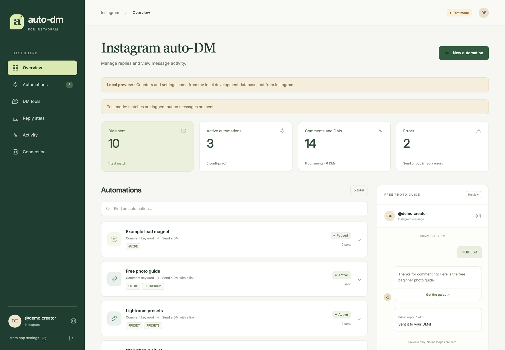

# ManyChat-Lite on Cloudflare

A small, self-hosted starter for building a ManyChat-style Instagram auto-DM tool on Cloudflare Workers.

It listens for Instagram comment and DM webhooks, matches them against keyword rules you manage in a built-in dashboard, and replies by DM: a Meta Private Reply for comments, a normal DM inside Instagram's 24-hour window for messages. It also covers the DM tools people usually want next: conversation starters, story replies, links that open a specific reply, and follower checks. It stays small: one Worker, one D1 database, no runtime dependencies.

This project is not affiliated with ManyChat or Meta.

## What It Does

```text
Instagram webhook (comments, messages, messaging_postbacks, messaging_referral)
-> verify the Meta webhook signature
-> store the event in D1 so it is only processed once
-> comments: match active keyword rules
   DMs: starter tap, story rule, DM keyword or ig.me link
-> send the DM (and, for comments, an optional public reply)
-> record send status, errors and analytics
```

The starter defaults to `DRY_RUN=true` (test mode): matches are recorded as test matches and nothing is sent to Instagram until you explicitly go live.

## Features

- Keyword rules for comments: one Meta Private Reply DM per comment, with an optional link button
- Optional public comment replies; put several on separate lines and each comment gets one of them
- Comment deduping, and your own comments (by account ID or `OWNER_IG_USERNAME`) never trigger a rule
- Retries for failed sends; retrying a failed public reply only resends the public comment
- Instagram token auto-renewal: daily connection check, renewal before the 60-day expiry, AES-GCM encrypted storage in D1
- DM tools:
  - Conversation starters (up to four buttons in new chats), with separate Save and Publish steps
  - Story replies by story ID, story or link-sticker URL, or keyword (up to 30 rules)
  - Links to specific replies: `https://ig.me/<username>?ref=<reply>__<source>`
  - Optional follower-status check with follower and non-follower opening lines
  - Optional keyword replies to DMs
  - Custom text replies for anything that is not a keyword rule
- Password-protected admin dashboard: automations, live reply preview, DM tools, reply stats, comment and DM activity, connection status
- Meta webhook verification and request signature validation; admin forms only accept same-origin posts
- Cloudflare D1 migrations, Node and workerd test suites with mocked Meta requests

## Dashboard



*Dashboard with local demo data*

The dashboard lives at `/admin` and is protected by `ADMIN_TOKEN`. The sections:

- **Overview**: DMs sent, active automations, comments and DMs received, errors. In test mode the first tile counts test matches instead of deliveries.
- **Automations**: keyword rules with a chat-style preview of the DM, link button and public reply.
- **DM tools**: conversation starters, follower status, DM keyword replies, custom replies, story replies and links to your DMs.
- **Reply stats**: per rule and custom reply, comment matches and DM matches, DMs sent, errors and last delivery.
- **Activity**: the latest 50 comments (filter by status, keyword, username, date) and the latest 30 DMs, including starter taps, story replies, story mentions and link opens.
- **Connection**: the connected account, last check, next renewal and token expiry.

## Architecture

```text
Meta Instagram webhooks
        |
        v
Cloudflare Worker /webhook ---------> D1: comment_events, message_events,
        |                                 rules, automation_settings
        v
Instagram Graph API: private replies, DMs, public replies, conversation starters

Daily cron -> connection check + token renewal -> D1: instagram_tokens (encrypted)

Admin dashboard /admin
        |
        v
Rules, DM tools, reply stats, activity, retries, connection
```

For one creator, this is enough. For a real SaaS clone, keep this repo as the single-account prototype and add multi-tenant OAuth, billing, customer onboarding, and per-account token storage.

## Quick Start

### 1. Install

```bash
npm install
```

### 2. Create a D1 Database

```bash
npx wrangler login
npx wrangler d1 create manychat-lite-cloudflare
```

Copy the returned `database_id` into `wrangler.jsonc`, replacing `REPLACE_WITH_D1_DATABASE_ID`.

Then apply migrations:

```bash
npx wrangler d1 migrations apply manychat-lite-cloudflare --remote
```

### 3. Set Secrets

```bash
npx wrangler secret put WEBHOOK_VERIFY_TOKEN
npx wrangler secret put INSTAGRAM_APP_SECRET
npx wrangler secret put INSTAGRAM_ACCESS_TOKEN
npx wrangler secret put IG_USER_ID
npx wrangler secret put ADMIN_TOKEN
```

Use any long random string for `WEBHOOK_VERIFY_TOKEN`; paste the same value into Meta when adding your webhook callback.

Use `ADMIN_TOKEN` to log in to `/admin`.

Optional:

```bash
npx wrangler secret put OWNER_IG_USERNAME
```

That prevents your own comments from triggering auto-DMs (comments from the connected account ID are ignored anyway), and is used for DM links until the connection has been checked.

### 4. Deploy

```bash
npm run check
npm run deploy
```

Your endpoints will be:

```text
https://manychat-lite-cloudflare.<your-subdomain>.workers.dev/
https://manychat-lite-cloudflare.<your-subdomain>.workers.dev/admin
https://manychat-lite-cloudflare.<your-subdomain>.workers.dev/webhook
```

### 5. Configure Meta

Meta setup is the fiddly part. The click path below is for the current Meta dashboard pattern where Instagram setup lives under **Use cases**.

This starter is built for **Instagram API with Instagram Login**:

```text
https://graph.instagram.com/v25.0/{IG_USER_ID}/messages
```

Do not choose the Facebook Page token / `graph.facebook.com/{PAGE_ID}/messages` path unless you plan to adapt the code.

#### 5.1. Prepare the Instagram account

1. Open the Instagram account you want to test with.
2. Make sure it is a **Business** or **Creator** account.
   - Mobile app: Profile -> menu -> Settings and privacy -> Account type and tools -> Switch to professional account.
3. Make the account **public** while setting up the app. Meta's tester/token flow often fails silently for private accounts.
4. Confirm you can log in to this Instagram account directly. You will need to accept a tester invitation from this account.

#### 5.2. Create the Meta app with the Instagram use case

1. Go to [Meta for Developers](https://developers.facebook.com/apps/).
2. Click **Create App**.
3. On the use case screen, choose **Manage messaging and content on Instagram**.
   - It may appear under a **Content management** category.
   - If Meta asks what you want the app to do, this is the option you want.
4. Click **Next**.
5. Enter an app name and contact email.
6. If Meta asks for a business portfolio, choose one or skip it for local testing.
7. Click **Create app**.
8. Click **Go to dashboard**.

If you already created a blank app, open the app dashboard and use:

```text
Use cases -> Manage messaging and content on Instagram -> Customize
```

That should add the Instagram product and the **API setup with Instagram login** screen.

#### 5.3. Add the Instagram tester account

In development mode, Meta only lets app roles and testers authenticate. Add your Instagram account as a tester before generating tokens.

1. In the Meta app dashboard, open **App roles** or **Roles** in the left sidebar.
2. Click **Roles** if there is a nested roles page.
3. Click **Add people**.
4. Choose **Instagram Tester**.
5. Enter the Instagram username without `@`.
6. Click **Add**.
7. The account will usually show as **Pending**.

Now accept the invite from Instagram:

1. Log in to that Instagram account on web or mobile.
2. Go to **Settings**.
3. Open **Website permissions**.
4. Open **Apps and websites**.
5. Open **Tester invitations**.
6. Find your Meta app and click **Accept**.
7. Go back to the Meta app dashboard and refresh. The tester should now show as active.

If you see `Insufficient developer role`, this invite was not accepted or you are logged into the wrong Instagram account.

#### 5.4. Authenticate the Instagram account and generate a token

1. In the Meta app dashboard, open:

```text
Use cases -> Manage messaging and content on Instagram -> Customize
```

2. Find **API setup with Instagram login**.
   - In some dashboards it appears as `Instagram -> API setup with Instagram login`.
3. Find the **Instagram accounts** or **Generate access tokens** section.
4. Click **Add account** or **Add Instagram account**.
5. Log in with the same Instagram Business/Creator account you added as a tester.
6. Approve the requested permissions.
7. Back in the dashboard, click **Generate token** for that account.
8. Copy the token. This becomes `INSTAGRAM_ACCESS_TOKEN`.

The permissions you want for this starter are:

```text
instagram_business_basic
instagram_business_manage_comments
instagram_business_manage_messages
```

`instagram_business_manage_comments` is needed for comment webhooks and public replies. `instagram_business_manage_messages` is needed for private replies, DM replies, conversation starters and follower checks. `instagram_business_basic` covers the connection check and token renewal.

#### 5.5. Get the Instagram user ID

If Meta shows an Instagram user ID beside the connected account, copy it. That value becomes `IG_USER_ID`.

If not, run:

```bash
curl -G "https://graph.instagram.com/v25.0/me" \
  --data-urlencode "fields=user_id,username" \
  --data-urlencode "access_token=PASTE_INSTAGRAM_ACCESS_TOKEN"
```

Use the returned `user_id` as `IG_USER_ID`. It is the ID webhooks use as the recipient, and the connection check expects the token to belong to it.

#### 5.6. Copy the app secret

In the Meta app dashboard:

```text
App settings -> Basic -> App secret
```

Click **Show**, copy it, and use it as `INSTAGRAM_APP_SECRET`.

The Worker uses this to verify Meta webhook signatures. If your dashboard shows an Instagram-specific app secret under the Instagram setup page, use that value.

#### 5.7. Configure the webhook

Deploy the Worker before this step, because Meta will immediately call your URL to verify it.

1. In Meta's app dashboard, open:

```text
Use cases -> Manage messaging and content on Instagram -> Customize
```

2. Find the **Webhooks** section.
   - In some dashboards this is under `Instagram -> Webhooks`.
   - In older dashboards this is under `Products -> Webhooks`.
3. Click **Configure**.
4. Callback URL:

```text
https://manychat-lite-cloudflare.<your-subdomain>.workers.dev/webhook
```

5. Verify token: paste the same value you set as `WEBHOOK_VERIFY_TOKEN`.
6. Click **Verify and save** or **Save**.
7. Click **Manage** for webhook fields and subscribe to:

| Field | Used for |
| --- | --- |
| `comments` | Comment keyword rules (private reply and public reply) |
| `messages` | Incoming DMs, DM keyword replies, story replies and story mentions |
| `messaging_postbacks` | Conversation starter taps |
| `messaging_referral` | Links to specific replies (`ig.me` links) and their source |

Only `comments` is required for comment auto-DMs. Add the other three when you use the DM tools.

#### 5.8. Subscribe the Instagram account to the app

Configuring the callback URL does not subscribe your account by itself. Subscribe the professional account through `/{ig-user-id}/subscribed_apps`:

```bash
curl -X POST "https://graph.instagram.com/v25.0/PASTE_IG_USER_ID/subscribed_apps" \
  --data-urlencode "subscribed_fields=comments,messages,messaging_postbacks,messaging_referral" \
  --data-urlencode "access_token=PASTE_INSTAGRAM_ACCESS_TOKEN"
```

Check the result:

```bash
curl -G "https://graph.instagram.com/v25.0/PASTE_IG_USER_ID/subscribed_apps" \
  --data-urlencode "access_token=PASTE_INSTAGRAM_ACCESS_TOKEN"
```

The response should list your app and the four fields. Confirm the same fields in the Meta app dashboard.

#### 5.9. Test the Meta side

1. Keep `DRY_RUN` set to `"true"` in `wrangler.jsonc`.
2. Deploy:

```bash
npm run deploy
```

3. Tail logs:

```bash
npx wrangler tail
```

4. Comment one of your rule keywords, such as `GUIDE`, on a fresh post from another Instagram account.
5. Look for `dry_run_private_reply` in the logs and a **Test match** in the dashboard's activity list. DMs log `dry_run_dm_reply`.
6. If that works, set `DRY_RUN` to `"false"`, deploy again, and test a fresh comment.

#### 5.10. Common Meta setup problems

- **No "Generate token" button**: confirm the app has the Instagram use case customized, the Instagram account is public, the account is Business/Creator, and the tester invitation was accepted.
- **`Insufficient developer role`**: add the Instagram account under App roles -> Instagram Tester, then accept the invite from Instagram -> Settings -> Website permissions -> Apps and websites -> Tester invitations.
- **Webhook verification fails**: confirm the Worker is deployed, the callback URL ends in `/webhook`, and the verify token exactly matches `WEBHOOK_VERIFY_TOKEN`.
- **Webhook verifies but no comments or DMs arrive**: confirm the webhook fields from 5.7, the `subscribed_apps` call from 5.8, and that you are commenting on content owned by the connected Instagram account.
- **Dry run works but no DM sends**: confirm `DRY_RUN` is `"false"`, the token has message permissions, the comment is less than 7 days old, and you have not already sent a private reply to that comment.
- **DMs are recorded as "Reply window closed"**: Instagram only allows replies within 24 hours of the person's last message.
- **Connection says the token belongs to a different Instagram account**: `IG_USER_ID` must be the `user_id` returned by `/me` (see 5.5), not the app-scoped `id`.
- **Conversation starters do not show up**: publish them from the dashboard (saving alone does not publish), then open a new chat in the Instagram mobile app.
- **Works for your account but not other creators**: that is expected in development mode. For other people's accounts, you need Meta app review, Advanced Access, and a real OAuth onboarding flow.

Meta setup and app review are the hardest parts of this project. The code is small; the platform permissions are the work.

Useful official Meta docs to keep open:

- [Create an Instagram app](https://developers.facebook.com/documentation/instagram-platform/create-an-instagram-app)
- [Instagram webhooks](https://developers.facebook.com/documentation/instagram-platform/webhooks)
- [Private replies](https://developers.facebook.com/documentation/instagram-platform/private-replies)
- [Conversation starters (ice breakers)](https://developers.facebook.com/documentation/instagram-platform/instagram-api-with-instagram-login/messaging-api/ice-breakers)
- [ig.me links](https://developers.facebook.com/documentation/instagram-platform/instagram-api-with-instagram-login/messaging-api/ig-me)
- [User profile and follower status](https://developers.facebook.com/documentation/instagram-platform/instagram-api-with-instagram-login/messaging-api/user-profile)
- [App roles and testers](https://developers.facebook.com/documentation/development/build-and-test/app-roles)
- [Rate limits](https://developers.facebook.com/docs/graph-api/overview/rate-limiting/)

### 6. Add a Rule

Open `/admin`, log in with `ADMIN_TOKEN`, click **New automation** and create a rule:

- Automation name: `Free guide`
- Keywords: `GUIDE, checklist`
- DM message: `Thanks for commenting. Here is the guide.`
- Public comment reply (optional, one per line): `Sent it to you!` and `Check your DMs.`
- Button link: `https://example.com/guide`
- Button label: `Open guide`

Comments match keywords without case sensitivity. Instagram limits DM text to 1,000 characters (640 with a link button) and each public reply to 2,200 characters; the form checks this. The `KEYWORD` and `PRIVATE_REPLY_TEXT` values in `wrangler.jsonc` act as one extra fallback rule when no dashboard rule matches.

Comment `GUIDE` on a fresh Instagram post and watch logs:

```bash
npx wrangler tail
```

If `DRY_RUN=true`, you should see a `dry_run_private_reply` log. When ready, set `DRY_RUN` to `"false"` in `wrangler.jsonc`, deploy again, and test with a real comment.

## Instagram Token Renewal

Tokens from **API setup with Instagram login** expire after about 60 days. A daily cron (06:00 UTC, set in `wrangler.jsonc`) checks the connection and renews the token before it expires:

1. After deploying with a new token, open **Connection** in the dashboard and click **Check connection**. This verifies the token belongs to `IG_USER_ID` and starts the renewal schedule.
2. The first renewal waits 48 hours, because Meta cannot refresh a token issued less than 24 hours ago. Later renewals run every 30 days.
3. Renewed tokens are stored in D1, AES-GCM encrypted with a key derived from the `INSTAGRAM_ACCESS_TOKEN` secret. That secret stays the bootstrap credential; keep it configured. Private replies, DMs, public replies and DM tools always use the current token.
4. Replacing the `INSTAGRAM_ACCESS_TOKEN` secret starts a new renewal schedule and ignores the previous token state.

The Connection panel shows the last check, next renewal, expiry and any error. Temporary failures keep the working token and retry the next day. If Meta revokes access, the token expires, or it belongs to another account, the dashboard shows **Reconnect required**: generate a new token in Meta, replace the secret and check the connection again. Checks and renewal are off in test mode.

## DM Tools

Every DM tool sends either a keyword rule's DM (its message and link button) or a **custom reply**: a plain text reply managed in DM tools, such as "Ask a question". A paused rule pauses every starter, story rule and link that points at it. A rule or custom reply cannot be deleted while a starter or story rule still uses it.

In test mode, DM tools record **Test match** activity, but they never publish starters, look up profiles or send messages.

### Conversation Starters

Up to four buttons shown when someone opens a new chat with you in the Instagram mobile app. Each button has a title (up to 80 characters) and a reply.

**Save DM settings** stores the configuration. **Publish saved starters** separately updates Instagram, then reads the configuration back and only marks it **Published** when it matches. To remove starters, turn them off, save, and publish the removal. Requires the `messaging_postbacks` webhook field.

### Story Replies

A story rule matches replies to your stories (and story mentions) by any combination of story ID, story or link-sticker URL, and keyword; all filled fields must match. Keywords match whole words without case sensitivity, so `GUIDE` matches "guide!" but not "guidebook". A keyword without a story applies to replies to every story.

Rules for a specific story take priority over keyword-only rules. A paused matching rule blocks the reply instead of falling through to a broader rule. Up to 30 story rules can be saved. Story IDs appear in the DM activity list. Story media URLs can expire, so prefer a story ID or a link-sticker URL. Requires the `messages` webhook field.

### Links to Specific Replies

**Links to your DMs** lists one link per rule and custom reply:

```text
https://ig.me/<username>?ref=rule-3__website
https://ig.me/<username>?ref=text-ask__newsletter
```

The username comes from the connection check, or `OWNER_IG_USERNAME` until the connection has been checked. The part after `__` is a source (1-80 letters, numbers, hyphens or underscores) that shows up in the DM activity list. Links open Instagram on mobile. In an existing chat the reply is sent when the link is opened; in a new chat, after the person sends a message or taps a starter. Requires the `messaging_referral` webhook field.

### Follower Status

Turn on **Check follower status for incoming DMs** to look up the sender's username and whether they follow you after they message you or tap a starter. Opening a link alone does not allow that lookup, and this does not message new followers.

Optional opening lines for followers and non-followers (up to 80 characters each) are added before the reply when the result still fits Instagram's limit; otherwise the reply is sent unchanged. Lookups are cached for 24 hours (failures for five minutes). If the status is unavailable, the usual reply is sent.

### Keyword Replies in DMs

Turn on **Reply when a DM contains an automation keyword** to answer DMs with the matching rule's DM. Only active rules count, and keywords must appear as whole words. It is off by default. Requires the `messages` webhook field.

The order for an incoming DM is: starter tap, then story rule, then DM keyword, then `ig.me` link.

## Local Development

Run the Worker locally with a local D1 database:

```bash
cp .dev.vars.example .dev.vars
npx wrangler d1 migrations apply manychat-lite-cloudflare --local
npm run dev
```

Open `http://localhost:8787/admin` and log in with the `ADMIN_TOKEN` value from `.dev.vars`. `.dev.vars` is git-ignored; keep real credentials out of `.dev.vars.example`.

### Demo Data

To fill the dashboard with a fictional creator's rules, comments and DMs, load `scripts/demo-data.sql` into the **local** database:

```bash
npx wrangler d1 execute manychat-lite-cloudflare --local --file scripts/demo-data.sql
```

Never run it with `--remote`: it replaces the DM tools settings and adds fake activity. Running it again replaces the previous demo rows. The demo includes a connection record that matches the placeholder values in `.dev.vars.example`, so copy that file unchanged to see the Connection panel filled in.

### Send a Signed Test Webhook

With the placeholder `INSTAGRAM_APP_SECRET` and `IG_USER_ID` from `.dev.vars.example`:

```bash
BODY='{"object":"instagram","entry":[{"id":"your-instagram-professional-account-id","changes":[{"field":"comments","value":{"id":"local-test-1","text":"GUIDE please","from":{"id":"123","username":"local_tester"}}}]}]}'
SIG=$(printf '%s' "$BODY" | openssl dgst -sha256 -hmac "from-instagram-api-setup-page" | sed 's/^.* //')
curl -X POST http://localhost:8787/webhook \
  -H "content-type: application/json" \
  -H "x-hub-signature-256: sha256=$SIG" \
  -d "$BODY"
```

The comment shows up in the dashboard's activity list as a test match.

## Tests

```bash
npm test              # Node test runner (Node 22.13+)
npm run test:runtime  # token renewal and DM tools inside workerd (Miniflare)
npm run check         # TypeScript and wrangler deploy --dry-run
```

`npm test` bundles the Worker with esbuild, applies every migration to an isolated in-memory SQLite database and mocks all Meta requests. It covers signed webhooks, comment rules, rotating public replies, retries, test mode, dashboard auth and escaping, token renewal, DM routing, DM tools settings, stats and the demo data. `npm run test:runtime` runs the token and DM tools modules in Cloudflare's runtime with local D1. Nothing is sent to Instagram.

## Deploying Updates

Apply pending migrations before deploying a new version:

```bash
npx wrangler d1 migrations apply manychat-lite-cloudflare --remote
npm run check
npm run deploy
```

To turn on real sends, set `DRY_RUN` to `"false"` in `wrangler.jsonc` and deploy again.

## Turning This Into a ManyChat-Style SaaS

This repo is the single-account core. To support other creators, add these layers:

1. **OAuth onboarding**
   Let creators connect their Instagram professional account through Meta OAuth instead of manually pasting tokens.

2. **Tenant model**
   Add tables for `users`, `workspaces`, `connected_instagram_accounts`, `access_tokens`, `rules`, `events`, and `subscriptions`.

3. **Webhook routing**
   Route incoming webhook events by Instagram account ID, then load that account's rules and tokens.

4. **Token storage**
   This starter already renews and encrypts one account's token. A SaaS needs the same per connected account, with revocation and key rotation.

5. **Background delivery**
   Use Cloudflare Queues for retries, rate-limit handling, and webhook bursts.

6. **Billing**
   Add a plan model such as free trial, creator, and agency. Limit by connected accounts, rule count, or monthly matched comments.

7. **Meta review**
   Prepare a privacy policy, data deletion instructions, screencast, test account, and clear explanation of how your app uses Instagram permissions.

8. **Abuse controls**
   Add per-account send limits, audit logs, opt-out language, and safeguards against spammy keyword campaigns.

## Suggested Database Tables for SaaS

```sql
CREATE TABLE workspaces (
  id TEXT PRIMARY KEY,
  name TEXT NOT NULL,
  created_at TEXT NOT NULL
);

CREATE TABLE connected_instagram_accounts (
  id TEXT PRIMARY KEY,
  workspace_id TEXT NOT NULL,
  ig_user_id TEXT NOT NULL,
  username TEXT,
  encrypted_access_token TEXT NOT NULL,
  token_expires_at TEXT,
  created_at TEXT NOT NULL,
  updated_at TEXT NOT NULL
);

CREATE TABLE rules (
  id INTEGER PRIMARY KEY AUTOINCREMENT,
  workspace_id TEXT NOT NULL,
  ig_account_id TEXT NOT NULL,
  label TEXT NOT NULL,
  keywords TEXT NOT NULL,
  reply_text TEXT NOT NULL,
  public_reply_text TEXT,
  link_url TEXT,
  link_button_label TEXT,
  active INTEGER NOT NULL DEFAULT 1,
  created_at TEXT NOT NULL,
  updated_at TEXT NOT NULL
);

CREATE TABLE comment_events (
  comment_id TEXT PRIMARY KEY,
  workspace_id TEXT NOT NULL,
  ig_account_id TEXT NOT NULL,
  media_id TEXT,
  username TEXT,
  comment_text TEXT NOT NULL DEFAULT '',
  matched INTEGER NOT NULL DEFAULT 0,
  status TEXT NOT NULL,
  matched_rule_id INTEGER,
  matched_keyword TEXT,
  error TEXT,
  received_at TEXT NOT NULL,
  sent_at TEXT
);
```

## Useful Commands

```bash
npm run dev
npm test
npm run check
npm run deploy
npm run types
```

```bash
npx wrangler d1 execute manychat-lite-cloudflare --remote --command "SELECT comment_id, username, status, received_at, sent_at FROM comment_events ORDER BY received_at DESC LIMIT 20"
```

```bash
npx wrangler d1 execute manychat-lite-cloudflare --remote --command "SELECT message_id, source, status, matched_choice, received_at FROM message_events ORDER BY received_at DESC LIMIT 20"
```

```bash
npx wrangler d1 execute manychat-lite-cloudflare --remote --command "SELECT label, keywords, active FROM rules ORDER BY id"
```

## Important Limits

- Meta Private Replies are not general cold DMs.
- A private reply is tied to a user commenting on your Instagram professional account's content, and only one private reply per comment is allowed.
- DM replies are only possible within 24 hours of the person's last message.
- Conversation starters only appear in the Instagram mobile app, in new chats.
- Keep `DRY_RUN=true` until webhook delivery and matching are verified.
- Expect Meta app review to take more time than deploying the code.

## Files to Start With

- `src/index.ts` - Worker entry: webhooks, comment and DM routing, admin routes, Meta API calls
- `src/dashboard.ts` - dashboard markup, styles and client script
- `src/dm-features.ts` - DM tools settings, reply keys, conversation starter publishing, follower lookups
- `src/dm-features-panel.ts` - the DM tools part of the dashboard
- `src/dm-events.ts` - messaging webhook parsing and story rule matching
- `src/instagram-token.ts` - connection checks and token renewal
- `migrations/` - D1 schema; `0001`-`0003` comments and rules, `0004` token renewal, `0005`-`0007` DMs and DM tools
- `scripts/demo-data.sql` - local demo data
- `tests/` - Node and workerd tests
- `wrangler.jsonc` - Cloudflare Worker config and the daily cron
- `.dev.vars.example` - local development placeholders
